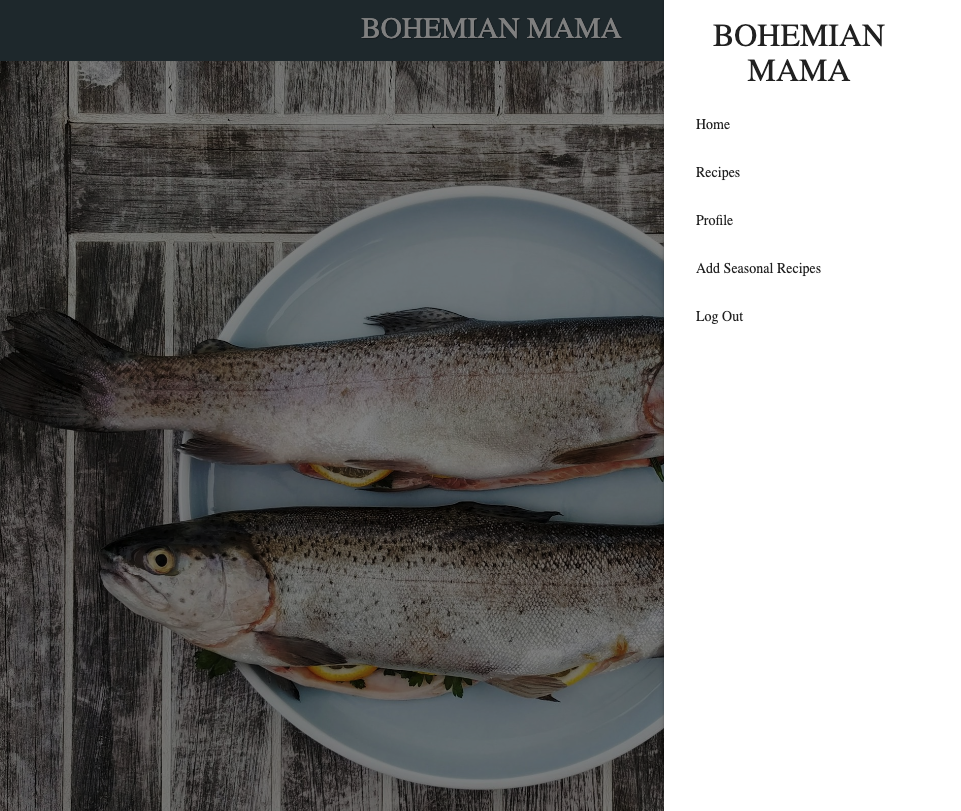
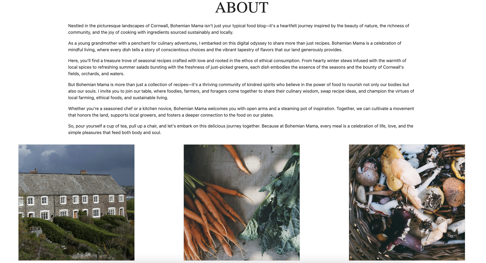
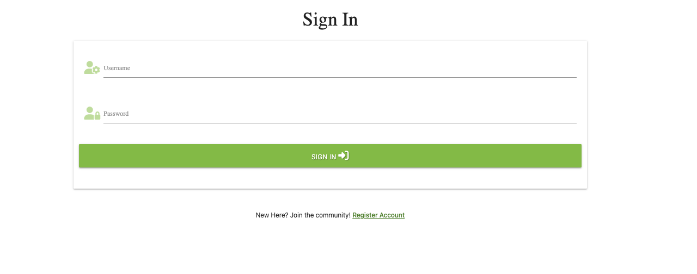
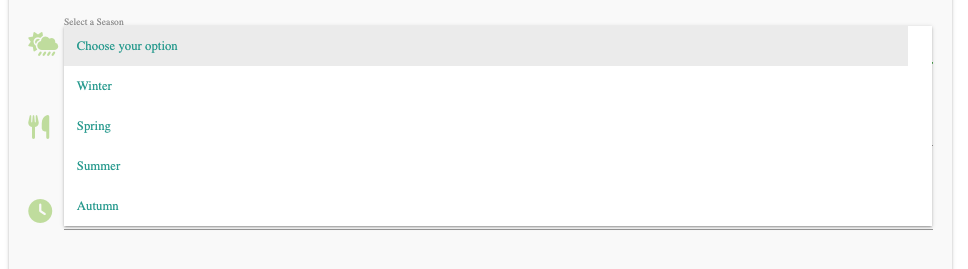

# Project 3: Bohemian Mama Food Blog

## Introduction

## Table of Contents

- [Blog-Goals](#blog-goals)
- [5-Planes-of-UX](#5-planes-of-ux)
- [User-Stories](#user-stories)
- [Wireframes](#wireframes)
- [Features](#features)
- [Technology](#technology)
- [Testing](#testing)
- [Deployment](#deployment)
- [Credits](#credits)
- [References](#references)

## Blog Goals

### Bohemian Mama is designed to achieve the following goals

- Create quality content and consistency.
- Build a strong online presence.
- Encourage engagement and interaction.
- Ensure the blog is mobile friendly and a good UX.
- Educate and celebrate local food produce.

### User Goals

- Access to seasonal recipes.
- Community engagement, encouraging users to share their thoughts, experiences and variations of recipes.
- Learning and skill development through recipe instructions.
- Establish an obvious place to leave feedback.
- Highlight eco-friendly and ethical considerations.
- An opportunity to upload and share user’s recipes and gain recognition.

## 5 Planes of UX

**Strategy:** Identify and create detailed user personas based on your target audience, taking into consideration factors like cooking expertise and interest in seasonal, local ingredients. Create a content that aligns with user interests. Plan the distribution of seasonal recipes, cooking tips, and user-generated content to keep the audience engaged.

**Scope:** Design features that enhance the user experience, such as a user-friendly recipe search, develop a mobile friendly website, and an easy to use comment system for users. Also, create a way for users to submit, share, and explore each other's recipes, creating a sense of community and collaboration.

**Structure:** Design a clear site structure that categorises recipes by season, ingredient. Ensure easy navigation to enhance the overall user experience.
Optimize the blog's design for various devices, especially mobile devices, to accommodate users who may access the blog while cooking or on the go.

**Skeleton:** Design a clean and visually appealing interface with a focus on readability, imagery, and ease of use. Incorporate interactive elements like step-by-step recipe guidlines and visually appealing images to enhance the engagement.

**Surface:** Maintain a consistent visual theme, including color schemes and imagery, that reflects the blog's logo and resonates with the target audience.
Implement feedback mechanisms, such as confirmation messages and notifications, to keep users informed about their actions and interactions on the blog.

## User Stories

### As a New Visitor 
- I want to easily navigate the website to find seasonal recipes that interest me. 
- I want to learn more about the blog owner and her approach to cooking with seasonal produce.

### As a Regular User
- I want to create a user profile to edit and delete my recipes and personalize my experience.

### As a Novice Cook 
- I want clear, step-by-step instructions with images to help me follow the recipes easily. 
- I want to find beginner-friendly recipes that require minimal cooking skills.

### As an Experienced Cook
- I want to contribute my own recipes and share my cooking experiences with the community.

### As a Mobile User
- I want the website to be mobile-friendly so I can access recipes easily from my phone or tablet.

### As a Community Member
- I want to leave comments on recipes to share my thoughts or ask questions.
- I want to participate in user-generated content campaigns or challenges.

### As a Local Food Advocate
- I want to learn about local farmers, markets, and producers featured in the blog.
- I want the blog to promote seasonal produce from the UK and specifically from Cornwall.

### As a Contributor
- I want a straightforward process to submit my own recipes, complete with images and personal anecdotes.
- I want my contributions to be recognized, whether through a featured section or community spotlight.

## Wireframes

#### Homepage

#### Register

#### Login

#### Add Recipe

#### Edit Recipe

#### Recipes

## Features

Each page consists of a navigation menu fixed to the top and a footer fixed to the bottom of the screen. 
The navigation bar is responsive with the screen size and becomes a hamburger icon with aside menu when the screen size shrinks.

### Homepage

On the homepage you will see a carousel of hero images that set the tone of the website - local, ethical, home cooking.
There is also a call to action button to encourage new users to sign up - Join the Community!
Below this there is an about section which explains the inspiration behind the blog and why new users should join the community.

### Register Page

We have a simple registration page that requires users to enter a username and password.
For a user to regsietr accordingly the username and password must be between 5 and 15 characters containing only letters (upper or lower case) and/or numbers. There is also a link below for those that have already registered.

If the input fields are filled in without the required letters or numbers an error message will display.

If a field is not filled an error message will display. 

### Sign In Page

The sign in page is similar looking to the register page. It has a register account link below. 

A flash error message is displayed if the incorrect username and / or password is entered.

If the user does not enter the correct number of characters similar to the register page it will display the same input field and format messages.

### Profile Page

Once logged in it will direct you to the profile page with flash message above.

### Add Seasonal Recipe Page

Once logged in you can add a seasonal recipe. The form consists of a selectfield input to select a season the recipe represents. Like all the forms on the site it will display a required error which is highlighted with a red line if the input field requirements are not met.

### Recipes

The seaonal recipes page displays recipes from all users of the site. Only the user in session can edit or delete their own recipe. Once an a recipe has been created from the Add Seasonal Recipes page it will direct you to the recipes page with a flash message.

### Edit Recipe

If you click the edit link it will bring you to the edit recipe page. From here you can edit any of the input fields displayed or cancel if you wish to exit without making any changes. All required fields and error messages are the same as the other form on the site. 

If a recipe has been edited correctly it will redirect to the recipes page and a flash meassge will display.

### Delete Recipe

You can also delete your own recipies as a user. 

## Deployment

### Setting up GitHub pages

1. To add files to the repository take the following steps
1. In the command line type - git add .
   git commit -m "This is being committed" git push
1. To add all new files or modified file use " ." - To add a single file use the pathway to the file eg .index.html or assets/css/style.css When committing make sure your comments are clear about what changes have been made. Pushing will send your work to the repository
1. Any changes made and pushed to the main branch will automatically show up on the site.

### Making changes to the website

First you need to sign-up to GitHub and Code Anywhere. To do this please see below.

#### Create a Code Anywhere account

1. If you don't already have one, go to the Code Anywhere website <https://codeanywhere.com/signup> and create a new account.
2. Enter first and last name.
3. Enter Email
4. Enter new password

#### Create a GitHub account

1. If you don't already have one, go to the GitHub website <https://github.com/> and create a new account.
2. Click sign up
3. Enter email address
4. Enter username
5. Create password
6. Verify your account by solving the puzzles
7. Click create account
8. Verify your account in using your sign-up email

To access the code to this project there are two options: **Cloning** and **Forking**.

Cloning: code will be linked to your repo and any pushes you make will go to the original developer for approval.

#### Here is how to clone code

1. On GitHub.com, navigate to the main page of the repository. You can find that [here](#######################)
2. Above the list of files, click <> **Code**.
3. Copy the URL for the repository.
4. In a separate tab, open Code Anywhere
5. Create a new workspace
6. Type ' git clone ', and then paste the URL you copied earlier.
7. Press Enter to create your local clone.

Forking: refers to creating a personal copy of someone else's repository under your own GitHub account. This copy is stored in your account and allows you to freely experiment with and make changes to the code without affecting the original repository. If I make changes to the original repo you will be informed and have the option to pull.

#### Here is how to fork code

1. Log in to your GitHub account and navigate to the repository you want to fork. You can find that [here](https://github.com/DomGambarini/first-milestone-project)
2. On the repository's page, click on the "Fork" button located at the top right corner of the page. This action creates a copy of the repository under your GitHub account.
3. GitHub will redirect you to the forked repository, which is now hosted under your account. You can identify it by the "forked from" message displayed at the top of the repository name.
4. At this point, you have successfully forked the repository, and you can start working with the code.
