# Project 3: Bohemian Mama Food Blog

## Introduction

Welcome to Bohemian Mama, a hub for seasonal recipes inspired by ethical and local living in Cornwall. Join our community of food enthusiasts, farmers, and foragers to explore vibrant dishes rooted in mindful choices. Register to access the full website experience, including the ability to share, create, edit, and delete recipes. [View the site here.]()

## Table of Contents

- [Blog-Goals](#blog-goals)
- [5-Planes-of-UX](#5-planes-of-ux)
- [User-Stories](#user-stories)
- [Wireframes](#wireframes)
- [Features](#features)
- [Technology](#technology)
- [Testing](#testing)
- [Deployment](#deployment)
- [Credits](#credits)
- [References](#references)

## Blog Goals

### Bohemian Mama is designed to achieve the following goals

- Create quality content and consistency.
- Build a strong online presence.
- Encourage engagement and interaction.
- Ensure the blog is mobile friendly and a good UX.
- Educate and celebrate local food produce.

### User Goals

- Access to seasonal recipes.
- Community engagement, encouraging users to share their thoughts, experiences and variations of recipes.
- Learning and skill development through recipe instructions.
- An opportunity to upload and share users recipes and gain recognition.

## 5 Planes of UX

**Strategy:** Identify and create detailed user personas based on your target audience, taking into consideration factors like cooking expertise and interest in seasonal, local ingredients. Create a content that aligns with user interests. Plan the distribution of seasonal recipes, cooking tips, and user-generated content to keep the audience engaged.

**Scope:** Design features that enhance the user experience, such as a user-friendly a mobile friendly website, and an easy to use comment system for users. Also, create a way for users to submit, share, and explore each other's recipes, creating a sense of community and collaboration.

**Structure:** Design a clear site structure that categorises recipes by season. Ensure easy navigation to enhance the overall user experience.
Optimize the blog's design for various devices, especially mobile devices, to accommodate users who may access the blog while cooking or on the go.

**Skeleton:** Design a clean and visually appealing interface with a focus on readability, imagery, and ease of use. Incorporate interactive elements like step-by-step recipe guidlines and visually appealing images to enhance the engagement.

**Surface:** Maintain a consistent visual theme, including color schemes and imagery, that reflects the blog's logo and resonates with the target audience.

## User Stories

### As a New Visitor

- I want to easily navigate the website to find seasonal recipes that interest me.
- I want to learn more about the blog owner and her approach to cooking with seasonal produce.

### As a Regular User

- I want to create a user profile to edit and delete my recipes and personalize my experience.

### As a Novice Cook

- I want clear, step-by-step instructions with images to help me follow the recipes easily.
- I want to find beginner-friendly recipes that require minimal cooking skills.

### As an Experienced Cook

- I want to contribute my own recipes and share my cooking experiences with the community.

### As a Mobile User

- I want the website to be mobile-friendly so I can access recipes easily from my phone or tablet.

### As a Community Member

- I want to leave comments on recipes to share my thoughts or ask questions.
- I want to participate in user-generated content campaigns or challenges.

### As a Local Food Advocate

- I want to learn about local farmers, markets, and producers featured in the blog.
- I want the blog to promote seasonal produce from the UK and specifically from Cornwall.

### As a Contributor

- I want a straightforward process to submit my own recipes, complete with images and personal anecdotes.
- I want my contributions to be recognized, whether through a featured section or community spotlight.

### Wireframes

#### Homepage Wireframes

#### Register

#### Login

#### Add Recipe

#### Edit Recipe

#### Recipes

## Features

Each page consists of a navigation menu fixed to the top and a footer fixed to the bottom of the screen.
The navigation bar is responsive with the screen size and becomes a hamburger icon with aside menu when the screen size shrinks.

### Homepage

On the homepage you will see a hero image that set the tone of the website ang grabs the users attention - local, ethical, home cooking.
Below this there is an about section which explains the inspiration behind the blog and why new users should join the community along with imagery to inspire the user.

### Register Page

We have a simple registration page that requires users to enter a username and password.
For a user to register accordingly the username and password must be between 5 and 15 characters containing only letters (upper or lower case) and/or numbers. There is also a link below for those that are members of the site to Log in instead.

If the input fields are filled in without the required letters or numbers an error message will display.

If a field is not filled an error message will display.

### Sign In Page

The sign in page is similar looking to the register page. It has a register account link below.

A flash error message is displayed if the incorrect username and / or password is entered.

If the user does not enter the correct number of characters similar to the register page it will display the same error messages - "Please match the format requested" or "Please fill in the field".

### Profile Page

Once logged in it will direct you to the profile page with a flash message above.

### Add Your Own Seasonal Recipe Page

Once logged in you can 'Add Your Own Seasonal Recipe'. The form consists of a selectfield input to select a season the recipe represents. Like all the forms on the site it will display a required error which is highlighted with a red line if the input field requirements are not met.

### The Seasonal Recipes Page

The 'Seaonal Recipes' page displays recipes from all users of the site. Only the user in session can access the 'edit' or 'delete' links as shown on each recipe card. All users have access to 'view recipe' link. Once a recipe has been created from 'Add Your Own Seasonal Recipe' page it will direct you to the 'Seasonal Recipes' page with a flash message - 'Your recipe has been uploaded!'

### View Recipe Page

If you click the 'View Recipe' link as shown above on the recipe card it will bring you a full size recipe page with further instructions and method. There's a 'Return To All Recipes' link at the bottom of the card which directs the user back to 'Seasonal Recipes'

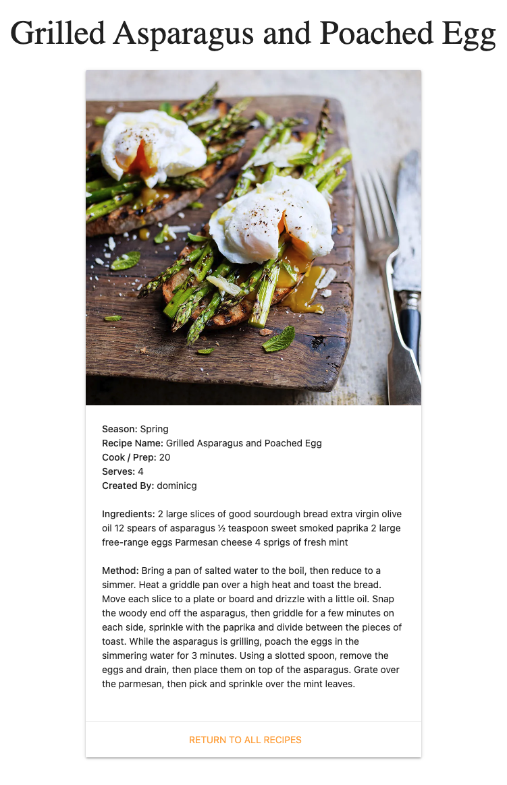

### The Edit Recipe Page

If you click the edit link it will bring you to the edit recipe page. From here you can edit any of the input fields displayed or cancel if you wish to exit without making any changes. All required fields and error messages are the same as the other form on the site.

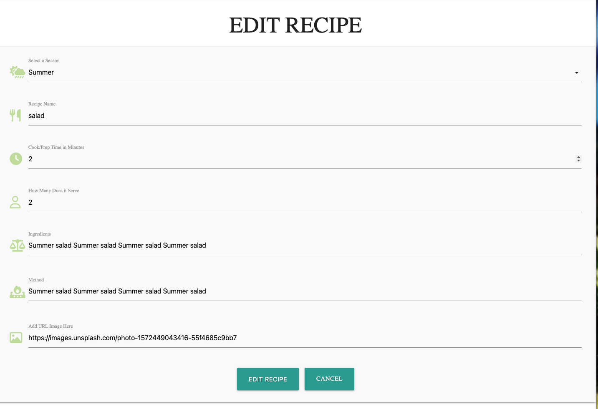

If a recipe has been edited correctly it will redirect to the recipes page and a flash meassge will display.

### Delete Recipe

You can also delete your own recipe as a user. If you click the link 'Delete' it will direct you to the 'Delete Recipe?' page. By clicking Delete it will remove it from the database and 'Seasonal Recipes' page. Both the cancel and delete button will direct you to the 'Seasonal Recipe' page.  

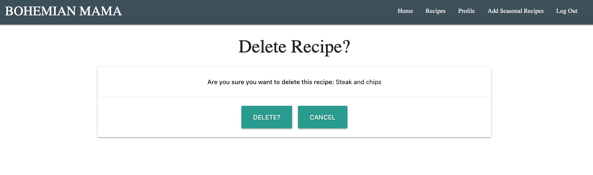

## Technology

- **Language:** HTML, CSS, Python
- **Framworks:** Flask, Materialize
- **Libraries:** jQuery, WTForms
- **Database:** MongoDB
- **Google Fonts:** Playfair Display for all content, headings, navigation and forms
- **Font Awesome:** for the social media icons in the footer and all form icons
- **Code Anywhere:** used as a cloud code editor.
- **GitHub:** used as a cloud based code repository.
- **Heroku:** App deployed to Heroku.

### Color used

- **Nav bar:** blue-grey darken-2 from Materialize
- **Buttons:** Green #8BC34A and Teal #26A69A
- **Footer:** Shade of pink #ee6e73
- **Content:** black

## Testing

The manual testing procedure involved examining the functions of individual website features. Chrome DevTools facilitated testing across various screen dimensions.

| Test Feature                   | Test Action                                                             | Expected Result                                                                   | Test Result |
| ------------------------------ | ----------------------------------------------------------------------- | --------------------------------------------------------------------------------- | ----------- |
| Navigation links.              | Click all links in navigation menu on each page.                        | Each link leads to expected page from any page.                                   | PASS        |
| Navigation menu responsiveness | Resize the screen below and above 993px wide.                           | Navigation menu collapses into a hamburger icon on screens lower than 993px wide. | PASS        |
| Homepage about content         | Resize the screen below and above 993px wide.                           | About content enlarges and retracts smoothly and accordingly to screen size       | PASS        |
| Homepage three images          | Resize the screen below and above 993px                                 | Images stack and align with each other acording to screen size.                   | PASS        |
| Registration Page              | Enter existing username                                                 | Flash error message displays "Username / password already exists"                 | PASS        |
| Registration Page              | Enter existing password                                                 | Flash error message displays "Username / password already exists"                 | PASS        |
| Registration Page              | Enter incorrect number of characters for username                       | Error message displays                                                            | PASS        |
| Registration Page              | Enter incorrect number of characters for password                       | Error message displays                                                            | PASS        |
| Registration Page              | Enter incorrect type of characters for username                         | Error message displays                                                            | PASS        |
| Registration Page              | Enter incorrect type of characters for password                         | Error message displays                                                            | PASS        |
| Registration Page              | Register new user and Click link to Login                               | Redirect to login page with new user on database                                  | PASS        |
| Sign in Page                   | Enter incorrect username                                                | Flash error message displays                                                      | PASS        |
| Sign In Page                   | Enter incorrect password                                                | Flash error message displays                                                      | PASS        |
| Sign In Page                   | Enter incorrect number of characters for username                       | Error message displays with required red line visible                             | PASS        |
| Sign In Page                   | Enter incorrect number of characters for password                       | Error message displays with required red line visible                             | PASS        |
| Sign In Page                   | Click link to Register Account                                          | Redirect to Register page                                                         | PASS        |
| Sign In Page                   | Enter correct details to sign in                                        | Redirect to Profile page with flash message                                       | PASS        |
| Log Out Link                   | Click Log Out link                                                      | Redirect to Sign In page with flash message                                       | PASS        |
| Footer                         | Click social media icons                                                | Should redirect to appropiate websites                                            | PASS        |
| Add Seasonal Recipe Page       | Click select field dropdown and click each field                        | Each field can be selected accordingly                                            | PASS        |
| Add Seasonal Recipe Page       | Try to submit form without selecting a selectfield input                | Displays an error message                                                         | PASS        |
| Add Seasonal Recipe Page       | Enter input values incorrectly in each field                            | Displays an error message with a red line below                                   | PASS        |
| Add Seasonal Recipe Page       | Enter data in fields correctly and click submit                         | Redirect to recipes page with new recipe visiable and flash message. Databse updated | PASS        |
| Recipes Page                   | Click to open recipe card in full                                       | Redirects to View Recipe Page and the full recipe with instructions and method    | PASS        |
| Recipes Page                   | As a session user you can see links to edit and delete your own recipes | Delete and Edit Links Visible                                                     | PASS        |
| Recipes Page                   | Click delete link                                                       | Redirected to the delete recipe page                                              | PASS        |
| Recipes Page                   | Click edit link                                                         | Redirect to the edit recipe form                                                  | PASS        |
| Edit Recipe Page               | Form fields should be populated with recipe you have choosen to edit    | Form fields have exisiting data filled in accordingly                             | PASS        |
| Edit Recipe Page               | Click select field dropdown and click each field                        | Each field can be selected accordingly                                            | PASS        |
| Edit Recipe Page               | Try to submit form without choosing a selectfield option                | Displays an error message                                                         | PASS        |
| Edit Recipe Page               | Enter input values incorrectly in each field                            | Displays an error message with a red line below                                   | PASS        |
| Edit Recipe Page               | Click cancel button                                                     | Redirect to recipes page                                                          | PASS        |
| Edit Page                      | Enter data in fields correctly and click submit                         | Redirect to recipes page with the updated recipe visiable and flash message. Database Updated | PASS        |
| View Recipe Page               | Click the link 'Return To All Recipes'                                  | Redirects to the Seasonal Recipe Page                                             | PASS        |
| Delete Recipe Page             | Click the cancel button                                                 | Return to Seasonal Recipe Page                                                    | PASS        |
| Delete Recipe Page             | Click the Delete button                                                 | redirect to seaonal recipe page with flash message and recipe deleted from page and database | PASS |

### W3C HTML Validator Testing

The [W3C Markup Validation Service](https://validator.w3.org/) was used to validate the HTML files.

### W3C CSS Validator Testing

### Python Linter

### Lighthouse Reports Desktop

#### Add Recipe Form Desktop

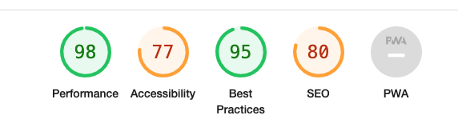

#### Edit Recipe Form Desktop

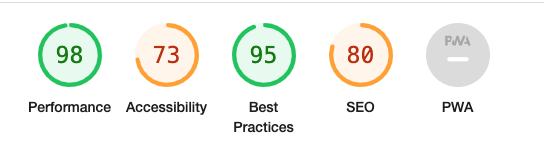

#### Index / Homepage Desktop

#### Profile Desktop

#### Recipe Page Desktop

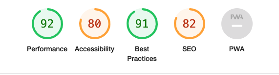

#### View Recipe Desktop

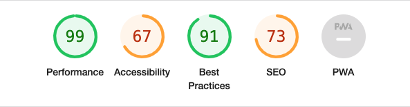

#### Delete Recipe Desktop

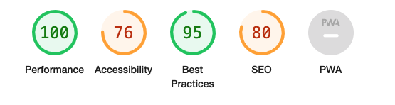

### Lighthouse Reports Mobile

#### Add Recipe Form Mobile

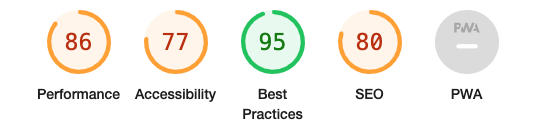

#### Edit Recipe Form Mobile

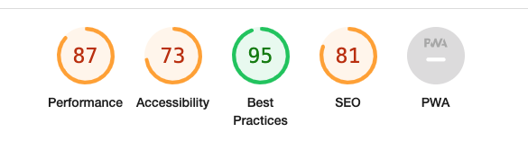

#### Index / Homepage Mobile

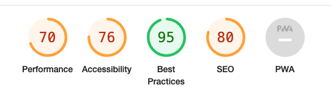

#### Profile Mobile

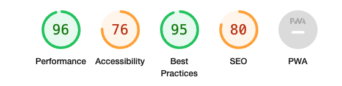

#### Recipe Page Mobile

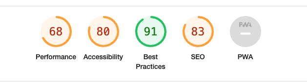

#### View Recipe Mobile

#### Delete Recipe Mobile

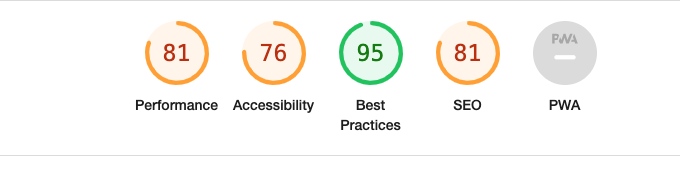

### Devices and Browser Testing

The site was checked across three different web browsers using macOS Big Sur version 11.7.6.

#### Browsers

- Safari 16.4.1
- Chrome 120.0.6099.199
- Firefox 122.0

#### Devices

- iPhone SE
- iPhone XR
- iPhone S2 Pro
- iPhone SE14 Pro Max
- Pixel 7
- Samsung Galaxy S8+
- Samsung Galaxy S20 Ultra
- Ipad Mini
- Ipad Pro
- Ipad Air
- Surface Pro 7
- Surface Duo
- Galaxy Fold
- Samsung Galaxy A51/71
- Nest Hub Max
- Nest Hub
- iPhone 4
- iPhone 6/7/8

## Bugs Encounted

1. The selectfield input does not have a required attribute and therefore when leaving the field blank it would not display an error message.
2. The edit recipe page was not populating the selectfield, textarea, and url inputs. This was beacuse it was not binding the form to an object. To fix this, I passed the obj attribute to the constructor.
3. When clicking to expand a recipe the modal would display the incorrect data from another recipe. I decided that it was better to create a new view recipe page and display the recipe in this format.
4. Trouble with edit recipe button. When it was clicked it would return to the same page with no changes in data. This was fixed by converting the href link to a button tag. You can only submit a form with a button not a href.
5. The three images below the About section on the homepage displayed the images but displayed a broken link icon in the corner. I had to change the img tag to a div tag as URL.

## Deployment

### Setting up GitHub pages

1. To add files to the repository take the following steps
1. In the command line type - git add .
   git commit -m "This is being committed" git push
1. To add all new files or modified file use " ." - To add a single file use the pathway to the file eg .index.html or assets/css/style.css When committing make sure your comments are clear about what changes have been made. Pushing will send your work to the repository
1. Any changes made and pushed to the main branch will automatically show up on the site.

### Making changes to the website

First you need to sign-up to GitHub and Code Anywhere. To do this please see below.

#### Create a Code Anywhere account

1. If you don't already have one, go to the Code Anywhere website <https://codeanywhere.com/signup> and create a new account.
2. Enter first and last name.
3. Enter Email
4. Enter new password

#### Create a GitHub account

1. If you don't already have one, go to the GitHub website <https://github.com/> and create a new account.
2. Click sign up
3. Enter email address
4. Enter username
5. Create password
6. Verify your account by solving the puzzles
7. Click create account
8. Verify your account in using your sign-up email

To access the code to this project there are two options: **Cloning** and **Forking**.

Cloning: code will be linked to your repo and any pushes you make will go to the original developer for approval.

#### Here is how to clone code

1. On GitHub.com, navigate to the main page of the repository. You can find that [here](https://github.com/DomGambarini/bohemian-mama-pp3)
2. Above the list of files, click <> **Code**.
3. Copy the URL for the repository.
4. In a separate tab, open Code Anywhere
5. Create a new workspace
6. Type ' git clone ', and then paste the URL you copied earlier.
7. Press Enter to create your local clone.

Forking: refers to creating a personal copy of someone else's repository under your own GitHub account. This copy is stored in your account and allows you to freely experiment with and make changes to the code without affecting the original repository. If I make changes to the original repo you will be informed and have the option to pull.

#### Here is how to fork code

1. Log in to your GitHub account and navigate to the repository you want to fork. You can find that [here](https://github.com/DomGambarini/bohemian-mama-pp3)
2. On the repository's page, click on the "Fork" button located at the top right corner of the page. This action creates a copy of the repository under your GitHub account.
3. GitHub will redirect you to the forked repository, which is now hosted under your account. You can identify it by the "forked from" message displayed at the top of the repository name.
4. At this point, you have successfully forked the repository, and you can start working with the code.

#### How to deploy to Heroku with CodeAnywhere

1. Create a new application using the Heroku dashboard.
1. Go to settings tab, click on 'reveal config vars' and add config vars such as IP (0.0.0.0), PORT (5000), MongoDB Name, MongoDB URI (URL with DB name and password).
1. Install Heroku via the console using 'npm install -g heroku'.
1. Log into Heroku via the console using 'heroku login' and follow the on screen instructions to log in.
1. Create a requirements.txt via the console using 'pip3 freeze > requirements.txt'.
1. Create a Procfile via the console using 'echo web: python app.py > Procfile'.
1. Connect GitHub to Heroku via the console using 'heroku git:remote -a bohemian-mama'
1. Commit all files in your project via the console using 'git add .' and 'git commit -m "Message"'.
1. Deploy your project to Heroku via the console using 'git push heroku master'.

#### Running the application locally using CodeAnywhere

1. Clone the repository as described above and upload it to CodeAnywhere.
1. Install the required libraries as specified in the requirements.txt.
1. Set your environment variables by creating env.py file and adding them there.
1. Create a .gitignore file in the root directory and include the env.py file to prevent it being pushed to GitHub.
1. Import the env.py file into the app.py file to access the enivironment variables.
1. Finally, run the application.

## Acknoldgements

### Credits

- User Authentication: From the Code Institute, Tim Nelson.
- All images from unsplash.com
- Understanding how to use and navigate Materialize, Tim Nelson.

### References

- YouTuber Pretty Printed and Codemy was my guide on how to use Flask WTForms.
- Brian Macharia for helping and guding me through this project.
